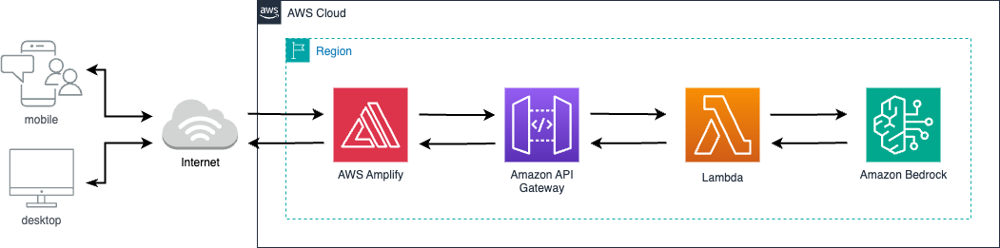

# AI Chat Application with Amazon Bedrock

A simple web application that allows users to chat with a Generative AI Foundation Model (Claude 3.7 Sonnet), powered by Amazon Bedrock and AWS Amplify.


## Features

- Real-time chat conversation with Claude FM
- Maintains conversation context for more coherent interactions

## Architecture Diagram



## Technologies Used

- AWS Amplify for fullstack single web app development
- React.js for frontend development
- Amazon API Gateway for REST API endpoints
- AWS Lambda (Python) for serverless backend processing
- Amazon Bedrock with Claude 3.7 Sonnet FM

## Prerequisites

- Node.js and npm installed
- AWS Amplify package
- AWS account with appropriate permissions
- AWS CLI configured
- Access to Amazon Bedrock FM models (e.g., Claude 3.7 Sonnet)
  - In the AWS Console, navigate to Amazon Bedrock and request access to Claude 3.7 Sonnet if you haven't already.

## Setup and Installation

### 1. Clone the repository

```bash
git clone https://github.com/MardiantoS/chat-ai-bedrock.git
cd chat-ai-bedrock
```

### 2. Install dependencies

```bash
npm install
```

### 3. Initialize Amplify

```bash
npm install -g @aws-amplify/cli
amplify configure
amplify init
```

Follow the prompts to configure your Amplify project.

### 4. Deploy backend services: API Gateway and Lambda

```bash
amplify push
```

### 5. Start the development server locally

```bash
npm start
```

## Project Structure

```
claude-chat-app/
├── amplify/              # AWS Amplify configuration and backend code
│   └── backend/
│       ├── api/          # API Gateway configuration
│       └── function/     # Lambda function code
├── public/               # Public assets
├── src/
│   ├── App.js            # Main application component
│   ├── App.css           # Application styles
│   └── index.js          # Application entry point
│   
├── .gitignore            # Git ignore file
├── package.json          # NPM dependencies
└── README.md             # Project documentation
```

## Deployment

To deploy the application to AWS Amplify Hosting:

Make sure to run, if you haven't already

```bash
amplify hosting add
```

then

```bash
amplify publish
```

## Configuration

The application uses AWS Amplify to manage the backend resources. The configuration is stored in `src/aws-exports.js` which is generated by the Amplify CLI.

## Security Considerations

- Ensure proper IAM permissions are set for the Lambda function
- Consider implementing user authentication for production use
- Set up appropriate rate limiting on your API Gateway
- Monitor usage to control costs

## Future Enhancements

- User authentication page 
- Storage for persistent conversation history 
- Streaming responses
- File upload capabilities
- Custom instructions for Claude

## License

This project is licensed under the MIT License - see the LICENSE file for details.

## Citation

If you use this code in your projects or research, please include the following citation:

> Mardianto Hadiputro. (2025). AI Chat Application with Amazon Bedrock. GitHub. https://github.com/MardiantoS/chat-ai-bedrock

## Acknowledgments

- Amazon Web Services for the infrastructure
- Anthropic for the Claude Foundation Model

---